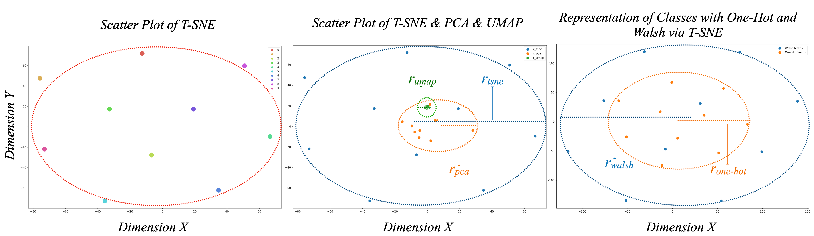
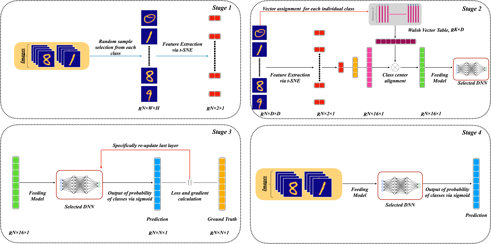
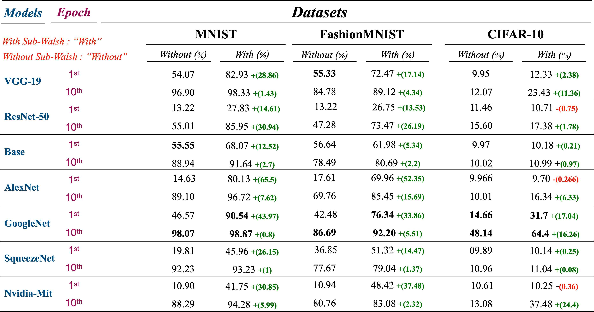

# Sup-Walsh (Effective Weight Initialization Technique)

We propose the auxiliary network model, called  $\textbf{Sup-Walsh}$  (Support Walsh), as a weight re-organizer that remains connected throughout the pretraining process. In this structure, our goal is to enhance the boundaries between classes, believing that expanding these boundaries makes them more distinguishable heuristically.


After conducting several experiments on data representation, we discovered that the Walsh Matrix approach yields the most significant differences. See the following plot for a visual representation of the reductions: 



The proposed solution has been tested on three publicly available datasets, [MNIST](http://yann.lecun.com/exdb/mnist/), [CIFAR-10](https://www.cs.toronto.edu/~kriz/cifar.html) , [Fashion-MNIST](https://github.com/zalandoresearch/fashion-mnist). Additionally, its success has been measured on popular classification models by integrating the developed support network. Sup-Walsh consistently outperformed others in the experiments although relative improvements vary across models and datasets


## Traditional Techniques

1. **Zero Initialization** - All weights are initialized to zero.
2. **Random Initialization** - Weights are initialized randomly.
3. **He Initialization** - Weights are initialized keeping in mind the size of the previous layer which helps in attaining a global minimum of the cost function faster and more accurately.
4. **Xavier/Glorot Initialization** - It's a way of initializing the weights such that the variance remains the same for x and y.


# Deep Learning Weight Initialization Techniques

This repository contains implementations of proposed weight initialization techniques used in deep learning. figures/Pipeline_Stages.png
Our design consist of 4 stages that is shown in Figure.  Initially, a random sample is chosen from each class within every batch. Subsequently, these samples undergo feature extraction using t-SNE. The processed data is then input into the Sup-Walsh, designed to relocate the class centers to maximize the distance between them, assisted by the Walsh matrix. Consequently, Sup-Walsh, which is integrated at the onset of the network and extracted after completing the initial pretraining phase, enables the main model to more effectively distinguish between classes. 

This repository contains implementations of our proposed method, Sup-Walsh. 



Our design consists of four stages, as shown in the figure above. The process begins by selecting a random sample from each class within every batch. These samples then undergo feature extraction using t-SNE. The processed data is input into Sup-Walsh, which is designed to relocate the class centers to maximize the distance between them, with the assistance of the Walsh matrix. Sup-Walsh is integrated at the beginning of the network and is extracted after the initial pretraining phase is complete. This allows the main model to distinguish between classes more effectively.

## Requirements

- Python 3.x
- matplotlib 3.7.2
- matplotlib-inline 0.1.6
- numpy 1.24.3
- pip  23.3
- QtPy 2.2.0
- requests 2.31.0
- torch 2.1.0
- scikit-learn 1.3.0

## Models and Datasets

The `ts_walsh_training.py` script supports the following models:

- Base
- AlexNet
- ResNet50
- VGG19
- GoogleNet
- SqueezeNet
- Nvidia

And the following datasets:

- MNIST
- CIFAR-10
- Fashion-MNIST

## Usage

Each technique is implemented in its own Python file. You can use them by importing the required file into your project.

You can also use the `ts_walsh_training.py` script to pretrain different models on various datasets. Here's an example:

```bash
python ts_walsh_training.py --model_name $model --dataset $dataset
```

You can also use the `main.py` script to train different main models on various datasets with or without Sup-Walsh.

And the following options:

- 0 (not pretrained)
- 1 (pretrained)

Here's an example:

```
python main.py --model_name $mdls --pre_trained $binary --dataset $data
```

## Results

Our proposed model, Sup-Walsh, has shown significant improvements over traditional weight initialization techniques. It consistently outperforms other methods across various models and datasets, enhancing the boundaries between classes and making them more distinguishable.

Here's a summary of our results:



For more detailed results, please refer to our [paper](link-to-paper).

# Contribtuion

This README file was generated by utilizng GitHub Copilot. It is intended for contribution purposes.

